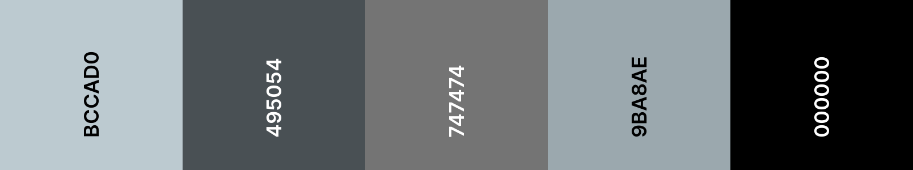

Стартовий проєкт використовує файл `default.css`, у якому ми призначаємо змінним кольори. Ця палітра кольорів містить відтінки сірого.

**Вибери**: зміни коди кольорів у `default.css` на ті, які хочеш бачити на своїй вебсторінці. Кольори вебсторінки оновляться, коли ти зміниш коди кольорів.

**Порада**: можна використати [coolors.co](https://coolors.co){:target="_blank"} для створення та налаштування колірних палітр, а потім оновити коди кольорів у `default.css`.

## --- code ---

language: html
filename: default.css
line_numbers: true
line_number_start: 4
line_highlights: 5-14
----------------------------------------------------------

:root {
\--primary: #bccad0;
\--onprimary:#4f4e4e;
\--secondary: #495054;
\--onsecondary:#ffffff;
\--tertiary:#747474;
\--ontertiary: #ffffff;
\--page:#ffffff;
\--onpage:#000000;
\--detail: #9ba8ae;
\--detail2: #000000;
}

\--- /code ---
